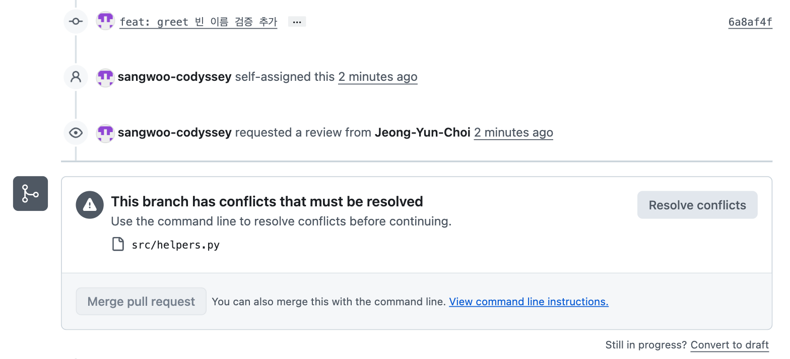

# Conflict Resolution Log

의도적으로 만든 충돌과 그 해결 과정을 기록한다. 항목: 참여자 · 상황 · 충돌 마커 원문 · 해결 과정(전략과 이유, 실제 명령) · 결과(PR/커밋) · 배운 점.
대응 흐름 자체는 [`CONTRIBUTING.md` › 충돌 대응 흐름](CONTRIBUTING.md) 참고.


## 충돌 기록 #1 — 같은 hunk 수정 (`format_price` 반올림 vs 천 단위 쉼표)

<!-- TODO(@P516n): PR #32 · #28 머지 후 작성. 참여자 / 상황 / 충돌 마커 / 해결 과정 / 결과 / 배운 점 -->


## 충돌 기록 #2 — 파일 이동(rename) vs 내용 수정 (`helpers.py` → `utils/greeting.py`)

### 참여자
- 작성자(해결한 쪽): @sangwoo-codyssey — `feature/sangwoo-greet-validation`, PR #33
- 상대(먼저 병합한 쪽): @whoawoodev — `feature/whoawoodev-move-helpers`, PR #31

### 상황 (What happened)
- 두 브랜치 모두 main `75bcafc` 에서 분기했다.
  - PR #31: `git mv src/helpers.py src/utils/greeting.py` 로 파일을 옮기고(커밋 `fed6888`, 내용 변경 없음), 이어서 `greet` 반환을 f-string `f"Hello, {name}!"` 으로 바꿨다(커밋 `10092ca`).
  - PR #33: **옛 경로** `src/helpers.py` 의 `greet` 에 빈 이름 검증(`ValueError`)과 `strip()` 을 추가했다(커밋 `6a8af4f`).
- #31 이 먼저 머지됐다(`5946b60`, 13:14). 직후 #33 을 열자 GitHub 이 `This branch has conflicts that must be resolved — src/helpers.py` 를 표시했다. main 에는 이미 없는 옛 경로를 충돌 파일로 지목한 점이 특징.



### 충돌 내용 (Conflict markers)
로컬에서 `git merge origin/main` 을 실행한 결과 원문:

```
$ git merge origin/main
Auto-merging src/utils/greeting.py
CONFLICT (content): Merge conflict in src/utils/greeting.py
Automatic merge failed; fix conflicts and then commit the result.

$ git status
On branch feature/sangwoo-greet-validation
You have unmerged paths.
Changes to be committed:
	deleted:    src/helpers.py
Unmerged paths:
	both modified:   src/utils/greeting.py
```

`src/utils/greeting.py`:

```python
def greet(name):
<<<<<<< HEAD:src/helpers.py
    """이름을 받아 인사말을 반환한다.

    앞뒤 공백을 제거한 이름을 사용하며, 빈 이름이면 ValueError 를 발생시킨다.

    >>> greet(" Kim ")
    'Hello, Kim'
    >>> greet("   ")
    Traceback (most recent call last):
        ...
    ValueError: name must not be empty
    """
    if not name.strip():
        raise ValueError("name must not be empty")
    return "Hello, " + name.strip()
=======
    """이름을 받아 인사말을 반환한다."""
    return f"Hello, {name}!"
>>>>>>> origin/main:src/utils/greeting.py
```

- 마커에 찍힌 경로가 양쪽이 다르다(`HEAD:src/helpers.py` / `origin/main:src/utils/greeting.py`). git 이 내용 유사도로 rename 을 감지해, 옛 경로에서 한 수정을 새 경로 파일 위에 옮겨 붙인 뒤 **내용 충돌**로 처리한 것이다.
- rename 감지에 실패했다면 `CONFLICT (modify/delete): src/helpers.py deleted in origin/main and modified in HEAD` 가 났을 상황이고, 그때는 수정 내용을 `greeting.py` 로 손으로 옮기고 `git rm src/helpers.py` 를 해야 한다.

### 해결 과정 (How)
- 전략: **combine** — 두 의도를 모두 유지. 한쪽만 고르면 검증(#33) 또는 f-string·느낌표(#31) 중 하나가 사라진다.
- 마커 안을 아래처럼 정리했다. 검증과 `strip()` 은 이쪽, f-string 과 `!` 는 main 쪽에서 가져왔다. doctest 기대값도 `'Hello, Kim'` → `'Hello, Kim!'` 로 함께 고쳤다 — 코드만 합치면 doctest 가 깨진다.

```python
def greet(name):
    """이름을 받아 인사말을 반환한다.

    앞뒤 공백을 제거한 이름을 사용하며, 빈 이름이면 ValueError 를 발생시킨다.

    >>> greet(" Kim ")
    'Hello, Kim!'
    >>> greet("   ")
    Traceback (most recent call last):
        ...
    ValueError: name must not be empty
    """
    if not name.strip():
        raise ValueError("name must not be empty")
    return f"Hello, {name.strip()}!"
```

- 검증:
  - `python3 -m doctest src/utils/greeting.py -v` → 2 passed
  - `greet(' Kim ')` → `'Hello, Kim!'` · `welcome_team(['A', ' B '])` → `['Hello, A!', 'Hello, B!']` · `greet('  ')` → `ValueError`
  - `grep -rn helpers src/` → 없음 · `python3 -c "import src.helpers"` → `ModuleNotFoundError` (옛 경로 잔재 없음)
- 커밋: `git add src/utils/greeting.py` (status 에 `R src/helpers.py -> src/utils/greeting.py`) → `git commit` → `1e37419` (부모 `6a8af4f` + `5946b60`) → `git push`.
- rebase 가 아니라 **merge** 로 해결해 force push 가 필요 없었다.

### 결과 (Outcome)
- PR #33 상태 `CONFLICTING` → `MERGEABLE`. 최종 `greet` 는 빈 이름 검증 + 공백 제거 + f-string 느낌표를 모두 반영.
- PR #33 머지 `3e6e237` (2026-09-17 14:32, 작성자 머지) — whoawoodev Approve(새 경로 확인) · 팀장 Approve + 결합 결과 라인 코멘트(빈 이름 `ValueError`·`greet` 내부 `strip()` 모두 현행 유지, `farewell` 은 별도 Issue 로). Issue #27 close.
- 관련: Issue #27 · PR #31 (머지 `5946b60`) · PR #33 (커밋 `6a8af4f` 옛 경로 수정, `1e37419` 충돌 해결, 머지 `3e6e237`) · 해결 기록 초안은 [PR #33 코멘트](https://github.com/codyssey-git-team/git-team/pull/33#issuecomment-5708561551)

### 배운 점 (Learnings)
- **파일 이동·이름 변경은 착수 전에 채널에 공유한다.** 상대가 옛 경로에서 작업 중일 수 있고, GitHub 의 충돌 표시도 옛 경로로 뜬다.
- 이동 커밋과 내용 변경 커밋을 **분리**하면(#31 이 그렇게 함) PR diff 에서 이동과 수정이 따로 보여 리뷰가 쉽다. 단, merge 의 rename 감지는 커밋 단위가 아니라 **분기점(merge-base)과 브랜치 끝의 파일 유사도**로 판단하므로 커밋을 나눈다고 감지 확률이 오르진 않는다 — 이번에 `modify/delete` 가 아닌 content 충돌로 떨어진 건 이동 후 변경이 한 줄이라 유사도가 높았기 때문.
- 합칠 때 코드만 보지 말고 **docstring·doctest·README 예시**처럼 결과값이 적힌 곳도 같이 갱신한다.
