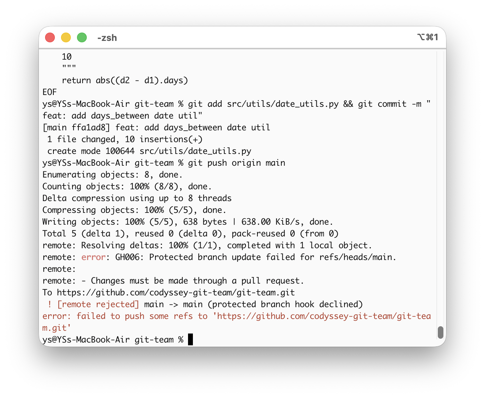
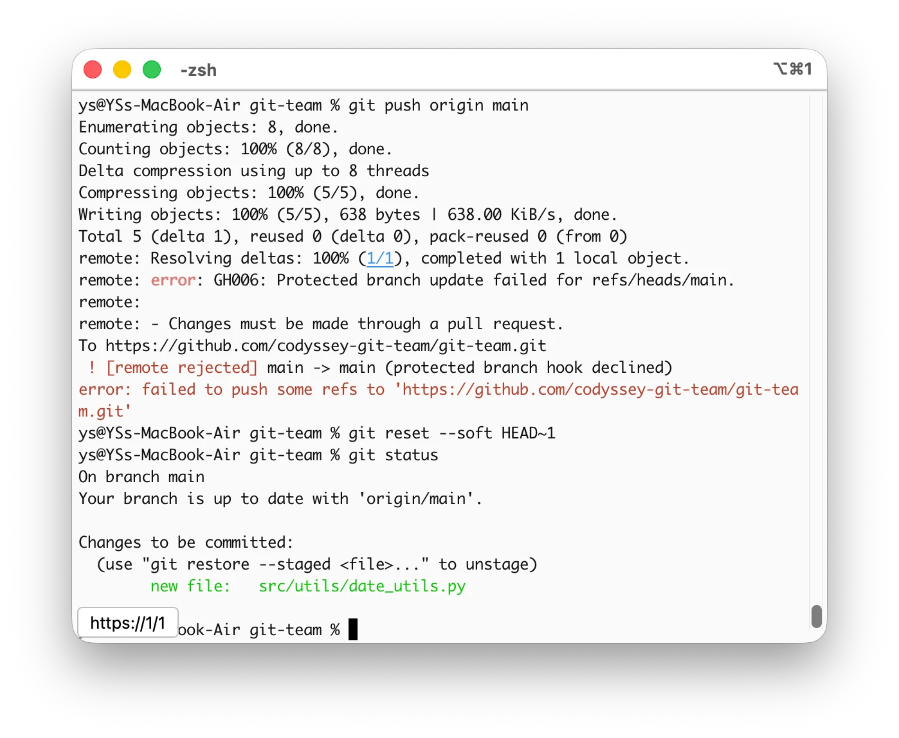
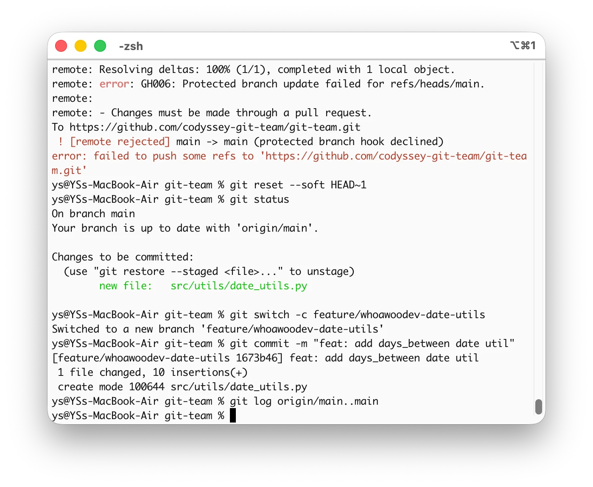
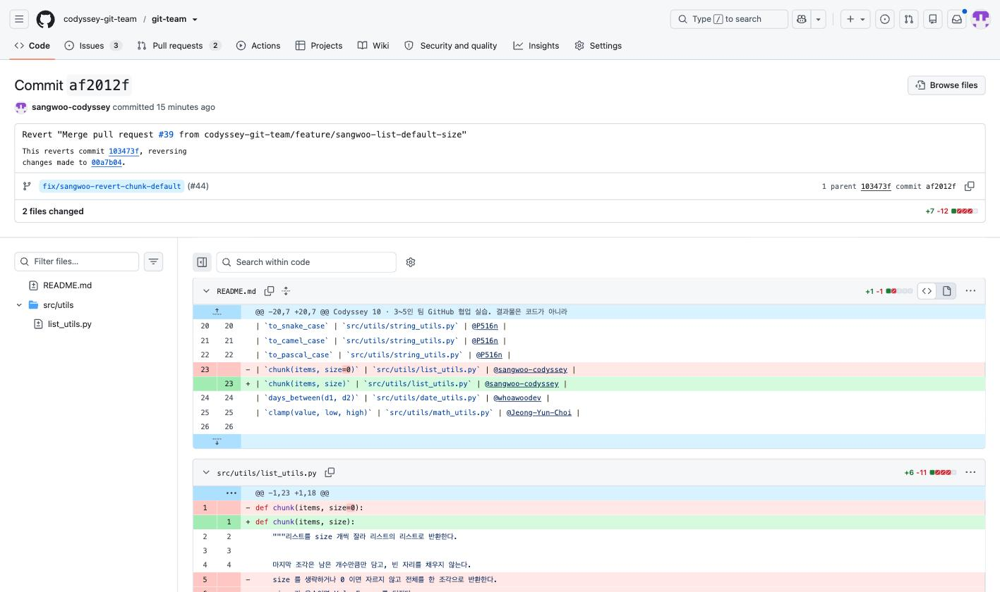
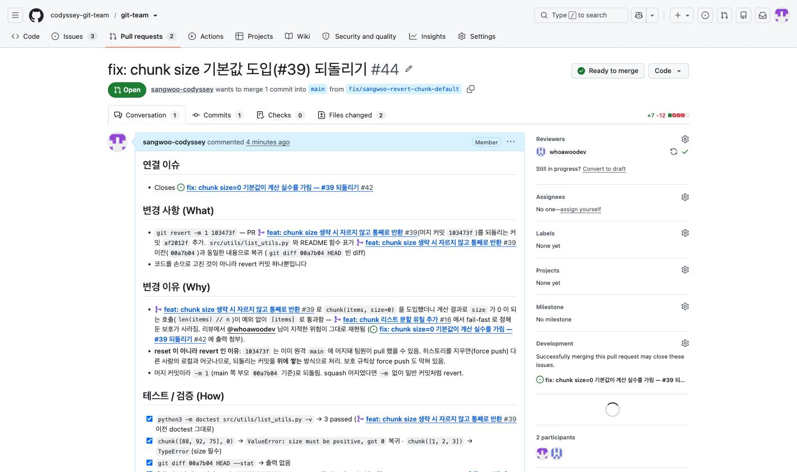
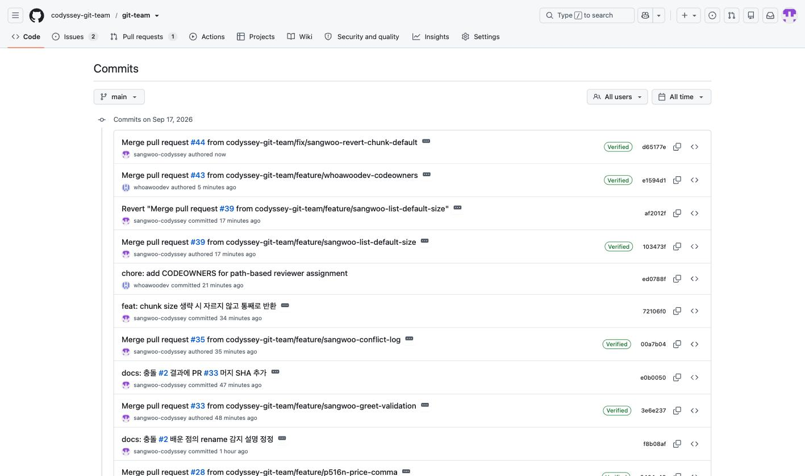

# Troubleshooting Log

Git 트러블슈팅 4종(amend · reset · revert · stash)의 실습 기록. 시나리오마다 참여자(이름+역할) · 상황(재현 가능한 설명) · 시도한 명령/절차(실제 출력) · 결과와 주의점(원격 히스토리·협업 영향) · 왜 이 방법을 선택했는가(Why)를 적는다.


## 시나리오: amend

<!-- TODO(@P516n): 참여자 / 상황 / 시도한 명령·절차 / 결과·주의점 / Why -->


## 시나리오: reset

### 참여자
- 실행·기록: @whoawoodev — `main` 에 직접 커밋한 뒤 되돌려 `feature/whoawoodev-date-utils` 로 옮김, 이후 PR #13 작성자
- 리뷰어: @P516n — 이 기록 PR 리뷰

### 상황
- P2 유틸 함수 작업을 시작하면서 브랜치를 만들지 않고 `main` 에서 `src/utils/date_utils.py` 를 작성해 커밋했다 (`ffa1ad8`).
- `git push origin main` 이 Branch Protection 에 막혔다 (`GH006: Protected branch update failed` — main 직접 push 금지).
- 커밋은 취소해야 하지만 작성한 파일은 잃지 않고 feature 브랜치로 옮겨야 했다. 커밋이 원격에 올라가지 않았으므로(push 거부) 로컬에서 되돌려도 다른 팀원에게 영향이 없는 상태였다.

  

### 시도한 명령/절차
- `main` 에서 잘못 커밋 → push 거부 확인 → `--soft` 로 커밋만 취소 → staged 유지 확인 → 브랜치 생성 → 같은 메시지로 재커밋 → 로컬 `main` 이 `origin/main` 과 같은지 확인.

  ```
  $ git add src/utils/date_utils.py && git commit -m "feat: add days_between date util"
  [main ffa1ad8] feat: add days_between date util
   1 file changed, 10 insertions(+)
   create mode 100644 src/utils/date_utils.py

  $ git push origin main
  Enumerating objects: 8, done.
  Counting objects: 100% (8/8), done.
  Delta compression using up to 8 threads
  Compressing objects: 100% (5/5), done.
  Writing objects: 100% (5/5), 638 bytes | 638.00 KiB/s, done.
  Total 5 (delta 1), reused 0 (delta 0), pack-reused 0 (from 0)
  remote: Resolving deltas: 100% (1/1), completed with 1 local object.
  remote: error: GH006: Protected branch update failed for refs/heads/main.
  remote:
  remote: - Changes must be made through a pull request.
  To https://github.com/codyssey-git-team/git-team.git
   ! [remote rejected] main -> main (protected branch hook declined)
  error: failed to push some refs to 'https://github.com/codyssey-git-team/git-team.git'

  $ git reset --soft HEAD~1

  $ git status
  On branch main
  Your branch is up to date with 'origin/main'.

  Changes to be committed:
    (use "git restore --staged <file>..." to unstage)
  	new file:   src/utils/date_utils.py

  $ git switch -c feature/whoawoodev-date-utils
  Switched to a new branch 'feature/whoawoodev-date-utils'

  $ git commit -m "feat: add days_between date util"
  [feature/whoawoodev-date-utils 1673b46] feat: add days_between date util
   1 file changed, 10 insertions(+)
   create mode 100644 src/utils/date_utils.py

  $ git log origin/main..main
  (출력 없음 — 로컬 main 에 origin/main 보다 앞선 커밋이 없음)
  ```

  
  

- reflog 에도 순서가 그대로 남아 있다: `ffa1ad8 commit` → `9157387 reset: moving to HEAD~1` → `checkout: moving from main to feature/whoawoodev-date-utils` → `1673b46 commit`.

### 결과
- 로컬 `main` 은 `origin/main`(`9157387`) 과 동일한 상태로 복구됐다 (`Your branch is up to date with 'origin/main'`).
- 작성한 파일은 staged 상태로 유지되어, 새 브랜치에서 같은 메시지로 다시 커밋했다 (`1673b46`). 취소된 `ffa1ad8` 은 브랜치 히스토리에서 사라졌고 reflog 에만 남는다.
- 이후 해당 브랜치를 push 하고 PR #13 (Closes #12) 으로 진행 → 리뷰 반영 `33cc40a` → 머지 `104e68c`.
- 주의할 점 (원격 히스토리 · 협업 영향):
  - `reset` 은 **push 되지 않은 로컬 커밋**에만 쓴다. 이미 원격에 올라간 커밋을 reset 하면 다른 팀원의 히스토리와 어긋나 force push 가 필요해지므로, 그 경우에는 `revert` 를 쓴다 (→ 시나리오: revert).
  - 이번에는 push 가 Branch Protection 에 거부되어 원격에 아무것도 올라가지 않았기 때문에 reset 이 안전했다. 보호 규칙이 없었다면 잘못된 커밋이 그대로 `main` 에 들어갔을 상황이다.
  - `reset` 옵션별 차이:
    - `--soft`: 커밋만 취소. 변경 사항은 staged 유지 → 바로 다시 커밋 가능
    - `--mixed` (기본값): 커밋 + staged 취소. 변경 사항은 working tree 에 남음 → `git add` 부터 다시
    - `--hard`: 커밋 + staged + working tree 변경 전부 삭제 → 작업 내용이 사라지므로 주의
  - 실수로 잘못 reset 했다면 `git reflog` 로 이전 HEAD 를 찾아 `git reset --hard <해시>` 로 돌아올 수 있다 (reflog 는 로컬에만 있고, 어느 브랜치에서도 닿지 않는 커밋의 항목은 기본 30일 · 닿는 항목은 90일 보관 — `gc.reflogExpireUnreachable` / `gc.reflogExpire`).

### 왜 이 방법을 선택했는가(Why)
- 목적이 "커밋을 다른 브랜치로 옮기기" 라서 파일 변경은 그대로 두고 커밋만 풀어야 했다. `--soft` 는 staged 상태를 유지하므로 브랜치 전환 후 `git add` 없이 바로 `git commit` 만 하면 된다.
- `--hard` 를 쓰면 작성한 파일 자체가 사라지고, `--mixed` 는 `git add` 를 한 번 더 해야 해서 이 상황에는 `--soft` 가 가장 맞다.
- `revert` 가 아닌 이유: revert 는 되돌리는 커밋을 하나 더 쌓는 방식이라 원격에 공유된 커밋에 쓴다. 이 커밋은 원격에 올라간 적이 없고 히스토리에 남길 이유도 없어서(브랜치를 잘못 고른 것뿐), 흔적 없이 지우는 reset 이 맞다.
- 관련: Issue #12 · PR #13 (커밋 `1673b46`, 반영 `33cc40a`, 머지 `104e68c`)


## 시나리오: revert

### 참여자
- 실행·기록: @sangwoo-codyssey — 도입 PR #39 (`feature/sangwoo-list-default-size`) 와 되돌린 PR #44 (`fix/sangwoo-revert-chunk-default`) 둘 다 작성자
- 리뷰어: @whoawoodev — PR #39 에서 위험을 라인 코멘트로 남기고 Approve, PR #44 에서 되돌린 결과를 검증하고 Approve

### 상황
- `chunk(items, size)` 는 #16 에서 `size <= 0` 이면 `ValueError` 로 즉시 실패(fail-fast)하기로 정했던 함수다.
- PR #39 (Issue #38, 커밋 `72106f0`): `size` 에 기본값 `0` 을 두고 "0 = 자르지 않고 통째로 반환" 이라는 의미를 부여했다. PR 본문에서 #16 결정을 뒤집는 것이 맞는지, `chunk([], 0)` 이 `[[]]` 인 것이 자연스러운지 리뷰어에게 결정을 요청했고, @whoawoodev 가 [L22 코멘트](https://github.com/codyssey-git-team/git-team/pull/39#discussion_r4033645868)로 "계산 결과로 `size` 가 0 이 되면 전에는 `ValueError` 로 잡혔는데 이제는 조용히 통과한다, `chunk([], 3)` 은 `[]` 인데 `chunk([], 0)` 은 `[[]]` 라 결과가 `size` 에 따라 달라진다" 는 위험을 남기고 Approve → 작성자 머지 `103473f` (2026-09-17 15:02).
- 머지 뒤 main `103473f` 에서 코멘트의 상황을 그대로 재현했다. 정수 나눗셈으로 `size` 가 0 이 되는 호출이 예외 없이 통과한다.

  ```
  scores=[88, 92, 75]  n_groups=10  size=len(scores)//n_groups=0
  chunk(scores, size) -> [[88, 92, 75]]   # 예외 없이 전체가 한 조각
  chunk(scores)       -> [[88, 92, 75]]   # size 를 빠뜨린 호출도 조용히 통과
  chunk([], 3)        -> []    vs   chunk([], 0) -> [[]]

  # 머지 전(00a7b04)에는 같은 호출이:
  chunk(scores, 0)    -> ValueError: size must be positive, got 0
  chunk(scores)       -> TypeError: chunk() missing 1 required positional argument: 'size'
  ```
- 문제 커밋은 이미 **원격 `main` 에 머지돼 있고**, 그 위에 다른 PR(#43 CODEOWNERS, `e1594d1`)까지 쌓인 상태였다. 팀원이 이미 pull 했을 수 있는 커밋이다. Issue #42 를 등록하고 되돌리기로 했다.

### 시도한 명령/절차
- 최신 main 에서 되돌리기용 브랜치를 따고, **머지 커밋**을 `-m 1` 로 revert 했다.

  ```
  $ git switch main && git pull --ff-only
  $ git log --oneline -1
  103473f Merge pull request #39 from codyssey-git-team/feature/sangwoo-list-default-size
  $ git switch -c fix/sangwoo-revert-chunk-default

  $ git revert -m 1 103473f --no-edit
  [fix/sangwoo-revert-chunk-default af2012f] Revert "Merge pull request #39 from codyssey-git-team/feature/sangwoo-list-default-size"
   2 files changed, 7 insertions(+), 12 deletions(-)

  $ git show --stat HEAD
  af2012f Revert "Merge pull request #39 from codyssey-git-team/feature/sangwoo-list-default-size"
      This reverts commit 103473f17cbaf5e52e0c9fa08ead7112e07c0fc1, reversing
      changes made to 00a7b042fb6a6e5d81fd5783c0b4d61c0bb4f59d.
   README.md               |  2 +-
   src/utils/list_utils.py | 17 ++++++-----------
  ```
- `-m 1` 의 의미: 머지 커밋 `103473f` 는 부모가 둘이다 — 첫 번째 `00a7b04`(main 쪽), 두 번째 `72106f0`(브랜치 쪽). `-m 1` 은 "첫 번째 부모를 기준으로" 라는 뜻이라, 브랜치가 main 에 가져온 변경만 정확히 취소된다.
- 되돌린 결과를 브랜치에서 검증했다.

  ```
  $ python3 -m doctest src/utils/list_utils.py -v | tail -3
  3 passed and 0 failed.
  $ python3 -c "from src.utils.list_utils import chunk; chunk([88, 92, 75], 0)"
  ValueError: size must be positive, got 0
  $ git diff 00a7b04 HEAD --stat
  (출력 없음 — main 쪽 부모와 파일 내용이 완전히 같음 = #39 변경만 정확히 되돌아감)
  ```
- push → PR #44 (Closes #42, 리뷰어 @whoawoodev) → Approve ("`git diff 00a7b04 HEAD` 가 비어 있는 것 확인했습니다. #39 이전 상태로 돌아갔습니다.") → 작성자 머지 `d65177e` (15:20) + 브랜치 삭제 → Issue #42 자동 close.
- 명령·출력 전문: [evidence/pr39-revert-2026-09-17.txt](evidence/pr39-revert-2026-09-17.txt)

### 결과
- main `d65177e` 에서 `chunk(scores, 0)` 이 다시 `ValueError`, doctest 3 passed. `git diff 00a7b04 main --stat` 에는 그 사이 머지된 `.github/CODEOWNERS` 만 나오고 `list_utils.py`·`README.md` 는 차이 없음.
- 히스토리에는 도입(`103473f`)과 취소(`af2012f` → 머지 `d65177e`)가 **둘 다 남는다**. 지워진 커밋은 없다.

  
  
  
- 주의할 점 (원격 히스토리 · 협업 영향):
  - 원격 `main` 은 보호 규칙(force push 금지, PR 필수)이라 `reset` 으로 커밋을 지울 수 없다. 지울 수 있는 상황이었더라도 이미 pull 한 팀원의 로컬 히스토리와 어긋나 그쪽에서 다시 문제가 된다.
  - 머지 커밋은 `-m` 을 지정하지 않으면 revert 가 거부된다. 부모 번호를 잘못 고르면(`-m 2`) main 쪽 변경이 되돌아가므로, 끝나고 `git diff <main 쪽 부모> HEAD` 가 비는지 반드시 확인한다.
  - 되돌린 뒤 같은 브랜치의 커밋 `72106f0` 을 다시 머지해도 변경이 들어오지 않는다 — git 은 이미 히스토리에 있는 커밋으로 본다. main `34383fc` 에서 확인:

    ```
    $ git merge 72106f0
    Already up to date.
    $ git merge-base --is-ancestor 72106f0 main && echo ancestor
    ancestor
    ```
    같은 변경을 다시 넣으려면 revert 커밋을 revert 하거나 새 커밋으로 만들어야 한다.
  - revert 도 일반 변경과 똑같이 PR 과 리뷰를 거쳤다 (#44). 되돌리는 것 자체가 팀이 확인해야 할 변경이다.
- 관련: Issue #38 · PR #39 (머지 `103473f`) · Issue #42 · PR #44 (커밋 `af2012f`, 머지 `d65177e`) · 팀장·P516n 의 앞선 사례 PR #18 (`35fc0ea`)

### 왜 이 방법을 선택했는가(Why)
- **revert 는 되돌렸다는 사실 자체가 커밋으로 남는다.** `103473f` 를 왜 취소했는지가 `af2012f` 의 메시지(`This reverts commit 103473f…`)와 PR #44 · Issue #42 에 그대로 이어지고, `git log` 만 봐도 "넣었다가 뺐다" 는 흐름이 보인다. `reset` 으로 지우면 실수가 있었다는 기록과 그 이유가 함께 사라진다.
- 커밋이 **이미 원격 `main` 에 있고 그 위에 #43 이 쌓인 뒤**였다. `reset` + force push 는 보호 규칙이 막기도 하지만, 허용됐더라도 이미 pull 한 팀원의 로컬은 지워진 커밋을 그대로 갖고 있어 다음 push 때 다시 살아나거나 충돌한다. 혼자 쓰는 브랜치가 아니면 히스토리를 지우는 방식은 선택지에서 빠진다.
- 손으로 `list_utils.py` 와 `README.md` 를 고쳐 새 커밋을 만들 수도 있었지만, 그러면 "#39 이전과 정확히 같은가" 를 사람이 보장해야 한다. `git revert -m 1` 은 머지 커밋이 가져온 diff 를 기계적으로 뒤집으므로 `git diff 00a7b04 HEAD` 가 비는 것으로 정확성을 검증할 수 있었다.
- revert 도 PR 로 올려 리뷰를 받은 이유: 되돌리는 것도 main 에 들어가는 변경이고, 도입 PR 에서 위험을 지적했던 리뷰어(@whoawoodev)가 "정확히 이전 상태로 돌아갔는지" 를 확인하는 것이 가장 자연스러운 검증이었다.


## 시나리오: stash

### 참여자

- 실행·기록: Jeong-Yun-Choi (팀장)
- 리뷰어: @sangwoo-codyssey (CODEOWNERS 자동 요청)

### 상황

로컬 `main`이 `d65177e`에 머물러 있는 동안 원격 `main`에 troubleshooting log의 변경이 먼저 머지되었다. 같은 파일을 로컬 초안과 원격 변경이 동시에 수정한 상태에서 최신 내용을 반영하려고 했다.

### 시도한 명령·절차

- `feature/choi-log-stash`를 `d65177e`에서 생성하고, 이미 추적 중인 `docs/troubleshooting-log.md`의 stash 섹션에 참여자와 상황 초안을 작성했다. 커밋하지 않은 채 파일을 stage했다.
- `main`으로 전환한 뒤 pull을 시도했다. 로컬 변경이 원격 변경으로 덮어쓰일 수 있어 pull이 거부되었다.

  ```
  $ git pull --ff-only . origin/main
  From .
   * remote-tracking branch origin/main -> FETCH_HEAD
  error: Your local changes to the following files would be overwritten by merge:
  	docs/troubleshooting-log.md
  Please commit your changes or stash them before you merge.
  Updating d65177e..715bb24
  Aborting
  ```

- 작업을 커밋하지 않고 stash에 보관한 뒤 `main`을 최신 원격 참조까지 fast-forward했다.

  ```
  $ git stash push -m "wip: stash 시나리오 초안"
  Saved working directory and index state On main: wip: stash 시나리오 초안
  $ git stash list
  stash@{0}: On main: wip: stash 시나리오 초안
  $ git merge --ff-only origin/main
  Fast-forward
  ```

- `d65177e`에서 문서가 이미 추적 중인 것을 확인했다. 같은 파일의 같은 위치를 원격 `main`과 stash 초안이 각각 수정한 상태에서 작업 브랜치에 최신 `main`을 반영한 뒤 stash를 적용해 content 충돌이 발생했다.

  ```
  $ git ls-tree d65177e docs/troubleshooting-log.md
  100644 blob beb922a9d5c0d4b276e0b21cb6396f57b112a4c0	docs/troubleshooting-log.md
  ```

  ```
  $ git switch feature/choi-log-stash
  $ git merge --ff-only main
  $ git stash pop
  Auto-merging docs/troubleshooting-log.md
  CONFLICT (content): Merge conflict in docs/troubleshooting-log.md
  The stash entry is kept in case you need it again.
  $ git status --short
  UU docs/troubleshooting-log.md
  ```

- 충돌 파일에서 `<<<<<<< Updated upstream`, `=======`, `>>>>>>> Stashed changes` 마커를 삭제했다. 원격 `main`의 기존 시나리오 섹션은 유지하고, stash의 Jeong-Yun 초안을 stash 섹션에 합쳤다.
- 해결 후 파일을 stage하고 stash를 삭제했다.

  ```
  $ git add docs/troubleshooting-log.md
  $ git stash drop stash@{0}
  Dropped refs/stash@{0}
  ```

### 결과와 주의점

- `git pull`이 거부되면 커밋하거나 stash해야 한다. stash는 로컬 전용이라 push되지 않는다.
- 커밋하지 않은 수정은 브랜치를 전환해도 작업 트리에 남을 수 있다.
- `git stash pop`에서 충돌이 발생하면 stash 항목이 자동 삭제되지 않고 남는다. 충돌 해결과 검증이 끝난 뒤 `git stash drop`으로 삭제한다.
- `d65177e`에서 `docs/troubleshooting-log.md`는 이미 추적 중인 파일이므로 일반 `git stash`로 수정사항이 보관된다. 반대로 새 파일을 stash하려면 기본 동작에 포함되지 않으므로 `git stash -u`가 필요하다.
- `stash pop`은 현재 체크아웃한 브랜치에 적용된다. 적용 전에 반드시 브랜치를 확인한다.

### 왜 이 방법을 선택했는가(Why)

- 아직 완성되지 않은 문서를 임시 커밋으로 남기지 않고 보관해야 했기 때문에 stash를 사용했다.
- `wip` 커밋을 만들면 히스토리에 초안이 남고, 초안을 지우고 다시 쓰면 작업 근거가 사라진다. stash는 작업 중인 변경을 잠시 치워 최신 `main`을 반영한 뒤 다시 적용할 수 있다.
- stash는 원격 히스토리를 변경하지 않으며, 충돌이 발생해도 stash가 남아 작업 손실을 줄일 수 있다.
